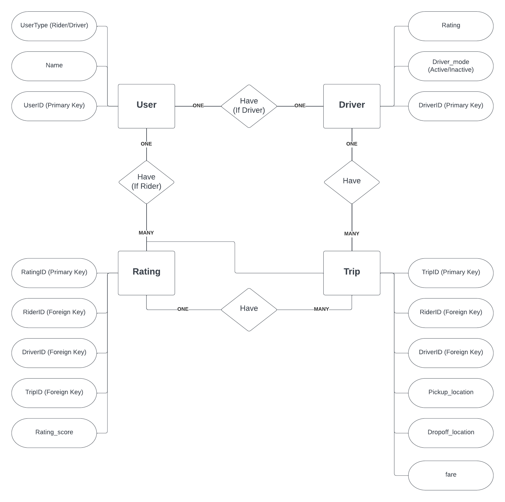

# RideShare

RideShare is a simple command-line based ride-sharing application that allows users to register as riders or drivers, and manage trips.
Authors: Luis Rivas, Gilberto Arellano

## Requirements

- Python 3.6 or higher
- MySQL
- `mysql-connector-python` package

## Installation

1. Clone the repository or download the source code.
2. Install the required package using the following command:

```sh
pip install mysql-connector-pytho
```

## Setup
1. Set up a MySQL server, create a user with a password and grant them necessary privileges to create, modify and delete databases.
2. Update the user and password variables in the main function in app.py with your MySQL user and password.
3. Load the rideshare_dump.sql file into your MySQL server to import the schema and populate the database.

## Running the Application
To run the application, navigate to the directory where the source code is located and run the following command:
```sh
python app.py
```

## Database Schema

The application uses the following database schema, with four tables:

1. User
    * UserID (int, Primary Key, Not Null)
    * Name (varchar(50), Not Null)
    * UserType (enum('Rider', 'Driver'), Not Null)
2. Driver
    * DriverID (int, Primary Key, Foreign Key, Not Null)
    * Driver_mode (bool, Not Null)
    * Rating (float, Not Null)
3. Trip
    * TripID (int, Primary Key, Not Null)
    * RiderID (int, Foreign Key, Not Null)
    * DriverID (int, Foreign Key, Not Null)
    * Pickup_location (varchar(200), Not Null)
    * Dropoff_location (varchar(200), Not Null)
    * Fare (decimal(7,2), Not Null)
4. Rating
    * RatingID (int, Primary Key, Not Null)
    * TripID (int, Foreign Key, Not Null)
    * RiderID (int, Foreign Key, Not Null)
    * DriverID (int, Foreign Key, Not Null)
    * Rating_score (int, Not Null, CHECK (Rating_score BETWEEN 1 AND 5))

## Entity-Relationship Diagram

